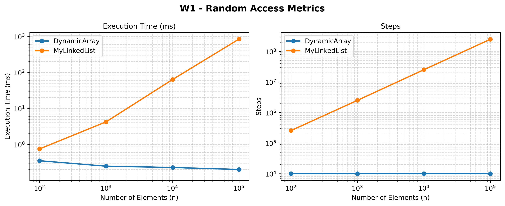
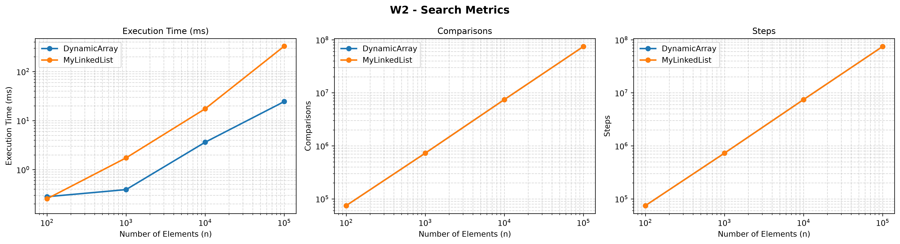
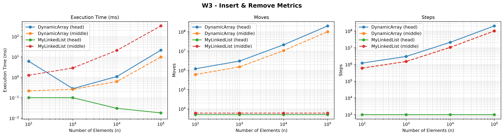
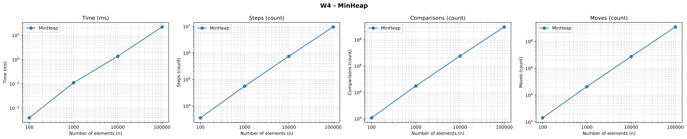

# Assignment 2 - Data Structures: In-Memory Workload Engine

Course: Design and Analysis of Algorithms
Student: NAME SURNAME, GROUP
Repository: GITHUB_LINK (branch `main`, tag `v1.0`)

## 1. Implementation Overview

Three structures were written from scratch, without `java.util` collections, and all of them store primitive `int` values:

- **DynamicArray** - `int[]` with initial capacity 10 and 2x growth when full.
- **MyLinkedList** - doubly linked list with `head`, `tail` and `size`; `getNode(index)` walks from the nearer end.
- **MinHeap** - array-based binary heap (`int[]`, same 2x growth), `insert` with bubble-up, `extractMin` with bubble-down.
  `DynamicArray` and `MyLinkedList` implement the same `IntList` interface, so a single benchmark code path runs both. Every method updates a `MetricsTracker` inside the operation itself:

- `steps` - one read of an array cell or one move to the next node;
- `moves` - one element shifted/written in the array or one pointer update in the list;
- `comparisons` - one comparison of two elements.
  Benchmark setup: sizes n = 100, 1 000, 10 000, 100 000; all data from `new Random(42)`; a global warm-up pass, then 2 warm-up runs per case (discarded) and 5 measured runs, median time reported; time is measured with `System.nanoTime()`. Results are in `results/results.csv`, charts in `results/plots/`.

## 2. Complexity Table

n is the current number of elements. "Amortized" refers to a sequence of operations. Θ is used when the bound is tight for that case, O or Ω when it is not.

### DynamicArray

| Operation | Best | Average | Worst | Aux. space | Justification |
|---|---|---|---|---|---|
| `add(x)` | Θ(1) | Θ(1) amortized | Θ(n) single op | O(1), Θ(n) during resize | Write at `data[size]`; when full, 2x growth copies n elements, but doubling gives O(1) amortized. |
| `add(i, x)` | Θ(1) | Θ(n) | Θ(n) | O(1), Θ(n) during resize | Elements `i..size-1` are shifted: 0 shifts for `i = size`, n shifts for `i = 0`, about n/2 on average. |
| `remove(i)` | Θ(1) | Θ(n) | Θ(n) | O(1) | Shifts `size-1-i` elements left: 0 for the last index, n-1 for index 0. |
| `get(i)` | Θ(1) | Θ(1) | Θ(1) | O(1) | Direct indexing, one cell read. |
| `contains(x)` | Θ(1) | Θ(n) | Θ(n) | O(1) | Linear scan: found at index 0 (best), about n/2 if present, n if absent. |
| Total memory | | | | Θ(n) | Capacity is between n and 2n ints. |

### MyLinkedList (doubly linked, with tail)

| Operation | Best | Average | Worst | Aux. space | Justification |
|---|---|---|---|---|---|
| `add(x)` | Θ(1) | Θ(1) | Θ(1) | O(1) | Append through `tail`, 3 pointer updates. |
| `add(i, x)` | Θ(1) | Θ(n) | Θ(n) | O(1) | O(1) at `i = 0` and `i = size`; otherwise `getNode` walks min(i, n-i) nodes, at most n/2. |
| `remove(i)` | Θ(1) | Θ(n) | Θ(n) | O(1) | Same traversal as `add(i, x)`, then 2 pointer updates. |
| `get(i)` | Θ(1) | Θ(n) | Θ(n) | O(1) | O(1) at the ends, n/2 steps in the middle, about n/4 on average. |
| `contains(x)` | Θ(1) | Θ(n) | Θ(n) | O(1) | Linear scan from `head`. |
| Total memory | | | | Θ(n) | One node object per element. |

### MinHeap

| Operation | Best | Average | Worst | Aux. space | Justification |
|---|---|---|---|---|---|
| `insert(x)` | Θ(1) | O(1) on random data | Θ(log n) | O(1), Θ(n) during resize | Bubble-up stops at once if `x >= parent`; at most the height of the tree, floor(log2 n), swaps. |
| `peekMin()` | Θ(1) | Θ(1) | Θ(1) | O(1) | Returns `data[0]`. |
| `extractMin()` | Θ(1) | Θ(log n) | Θ(log n) | O(1) | Best case: all elements equal, bubble-down stops immediately. The moved last element is usually large, so it sinks to the bottom, about log n levels. |
| Total memory | | | | Θ(n) | Capacity is between n and 2n ints. |

## 3. Loop Invariant Proofs

### 3.1 `DynamicArray.contains(x)`

```java
for (int i = 0; i < size; i++) {
    if (data[i] == element) return true;
}
return false;
```

- **Invariant:** before the iteration with index `i`, none of the elements `data[0..i-1]` is equal to `x`.
- **Initialization:** before the first iteration `i = 0`, so the range `data[0..-1]` is empty, and the statement is true trivially.
- **Maintenance:** assume the invariant holds before iteration `i`. If `data[i] == x`, the method returns `true` and the loop is left. Otherwise `data[i] != x`, so together with the invariant none of `data[0..i]` equals `x`. After `i++` this is exactly the invariant for the next iteration.
- **Termination:** the loop stops either by `return true` or because `i == size`. In the second case the invariant says that none of `data[0..size-1]` equals `x`.
- **Conclusion:** if the method returns `true`, it has found an index with `data[i] == x`, so `x` is in the array. If it returns `false`, the invariant at termination proves that all `size` elements differ from `x`. Since the loop runs at most `size` times, the method always terminates with the correct answer.
### 3.2 `MinHeap.bubbleDown(index)`

```java
while (true) {
    int l = 2 * index + 1, r = 2 * index + 2, smallest = index;
    if (l < size && data[l] < data[smallest]) smallest = l;
    if (r < size && data[r] < data[smallest]) smallest = r;
    if (smallest != index) { swap(index, smallest); index = smallest; }
    else break;
}
```

It is called with `index = 0` after `extractMin` moved the last element to the root and decreased `size`.

- **Invariant:** before each iteration with current index `i`: (a) every parent-child pair `(p, j)` satisfies `a[p] <= a[j]`, except possibly the pairs `(i, left(i))` and `(i, right(i))`; (b) if `i` has a parent `p`, then `a[p] <= a[c]` for every child `c` of `i`.
- **Initialization:** at the first iteration `i = 0`. Before the removal the array was a valid heap and only `a[0]` was overwritten, so only pairs that contain the root can be broken - these are exactly the excluded pairs in (a). The root has no parent, so (b) is true trivially.
- **Maintenance:** let `s` be the index of the smallest among `a[i]` and its children.
    - If `s == i`, then `a[i] <= ` both children, so the excluded pairs hold too. By (a) the whole array is a heap and the loop breaks.
    - Otherwise `a[s] < a[i]` and the algorithm swaps them. The new `a[i]` is the old `a[s]`, which is not larger than the other child, so both pairs of `i` with its children hold. The pair with the parent `p` holds by (b): `a[p] <= old a[s] = new a[i]`. The only pairs that may now be broken are those of `s` with its own children. For the pair `(i, s)`: new `a[i]` = old `a[s] < ` old `a[i]` = new `a[s]`, so it holds. For the children `c` of `s`: old `a[s] <= a[c]` held in the original heap, i.e. new `a[i] <= a[c]`, which is (b) for the new current index `s`. So the invariant holds for `index = s` at the next iteration.
- **Termination:** each iteration moves `index` to a child, so `index` at least doubles. It must stay below `size`, therefore the loop makes at most floor(log2 n) swaps and then reaches the `else break` branch (a node without children has `smallest == index`). At that moment `smallest == index`, i.e. `a[i]` is not larger than its children.
- **Conclusion:** at termination the excluded pairs of invariant (a) also satisfy the heap condition, so every parent is `<=` its children and the array is a valid min-heap again. Together with the fact that the removed root was the minimum, this proves that `extractMin` returns the smallest value and keeps the heap property. The loop makes O(log n) iterations.
## 4. Experimental Results

All charts have axis labels, units and a legend. Both axes are logarithmic. Values below are approximate readings for n = 100 000 (exact numbers are in `results/results.csv`).

| Workload | Structure | Time | Steps | Moves | Comparisons |
|---|---|---|---|---|---|
| W1 get | DynamicArray | about 0.25 ms | 10 000 | 0 | 0 |
| W1 get | MyLinkedList | about 800 ms | about 2.5e8 | 0 | 0 |
| W2 contains | DynamicArray | about 40 ms | about 7.5e7 | 0 | about 7.5e7 |
| W2 contains | MyLinkedList | about 350 ms | about 7.5e7 | 0 | about 7.5e7 |
| W3 head | DynamicArray | about 20 ms | about 2e8 | about 2e8 | 0 |
| W3 head | MyLinkedList | about 0.025 ms | 1 000 | 5 000 | 0 |
| W3 middle | DynamicArray | about 10 ms | about 1e8 | about 1e8 | 0 |
| W3 middle | MyLinkedList | about 350 ms | about 1e8 | 6 000 | 0 |
| W4 heap | MinHeap | about 22 ms | about 9e6 | about 3.5e6 | about 3e6 |

### W1 - Random Access


`DynamicArray.get` costs exactly one step, so steps stay at 10 000 and time is almost flat. The list needs about n/4 steps per call (walk from the nearer end), so steps and time grow linearly with n.

### W2 - Search


Both structures perform the same number of steps and comparisons: 500 present values cost about n/2 each and 500 absent values cost n each, about 750n in total. The curves of steps and comparisons overlap on the charts. The running time still differs by roughly 9x.

### W3 - Insert & Remove


At the head, the list does O(1) work (1 000 steps, 5 000 pointer updates, independent of n), while the array shifts about n elements per operation, so its moves grow linearly. In the middle, the list needs few pointer updates (6 000), but each operation must first walk to position n/2, so its steps are on the same order as the array shifts (about 1e8 for both) - and the list is about 35x slower in time.

### W4 - Priority Processing


Steps, comparisons and moves grow slightly faster than linearly, which matches Θ(n log n) for n insertions plus n extractions. The returned values were checked to be in non-decreasing order in every run of the benchmark.

## 5. Discussion

DynamicArray is faster for `get(i)` because the address of the element is computed directly, so one memory read is enough, whereas the list has to follow up to n/4 pointers. The array is also faster for plain iteration, because its ints lie next to each other in memory: one 64-byte cache line holds 16 ints, and the hardware prefetcher recognizes the sequential pattern and loads the next lines in advance. W2 shows that equal Big-O and even equal operation counts do not mean equal time: both structures made the same 7.5e7 steps, but the list was about 9x slower. In the list each step is pointer chasing - the address of the next node is known only after the previous node is loaded, so the CPU cannot overlap the memory accesses, and nodes allocated at different times can be far apart, which causes cache misses. In W3 (middle) the step counts are equal as well (about 1e8), yet the list is about 35x slower than the array, because the array shifts contiguous memory sequentially while the list walks through scattered objects. Each node is a separate object: on a typical 64-bit JVM with compressed references it takes 12 bytes of header plus 4 bytes of `int` and two 4-byte references, 24 bytes in total, compared with 4 bytes per int in the array, so the list uses about 6x more memory and fits in the cache about 6x worse. Allocating a node per element also loads the garbage collector, which has to trace and reclaim these small objects; the array has one large object and no per-element garbage. Our counters show the other side of the trade-off: in W3 (head) the list does only 1 000 steps and 5 000 pointer updates, independent of n, and is faster than the array by about three orders of magnitude (about 0.025 ms vs about 20 ms at n = 100 000). Therefore MyLinkedList is the better choice when most changes happen at the ends (queue, deque, stack-like usage), or when a node reference is already held so that no traversal is needed; it is a poor choice for index access, search, or insertion in the middle by index. The array is the default choice for random access and iteration. MinHeap is the right choice for priority scheduling: `peekMin` is O(1), and `insert` and `extractMin` are O(log n), while an unsorted array needs O(n) for extraction and a sorted array needs O(n) for insertion. A heap does not support fast search or sorted traversal, so it should only be used when we need just the current minimum. The measurements are medians of 5 runs after warm-up; very small times (for example, the list at the head, about 0.03 ms) are close to the timer resolution and show some noise.

## 6. Reproducibility

- Tests: `mvn test` (JUnit 5: edge cases, random comparison with `java.util` classes, heap property after every operation, sorted output).
- Benchmark: run `benchmark.BenchmarkRunner` (fixed seed 42); it writes `results/results.csv`.
- Plots: `python generate_plots.py` writes PNG files to `results/plots/`.
- Git: branches `feature/metrics`, `feature/array`, `feature/list`, `feature/heap`; release tag `v1.0` on `main`.
 